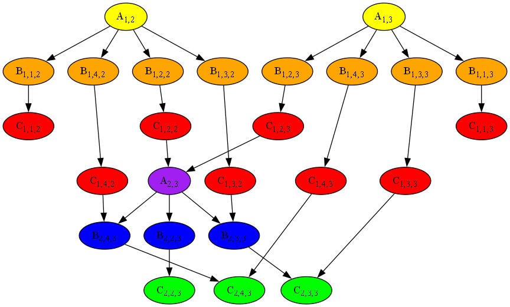
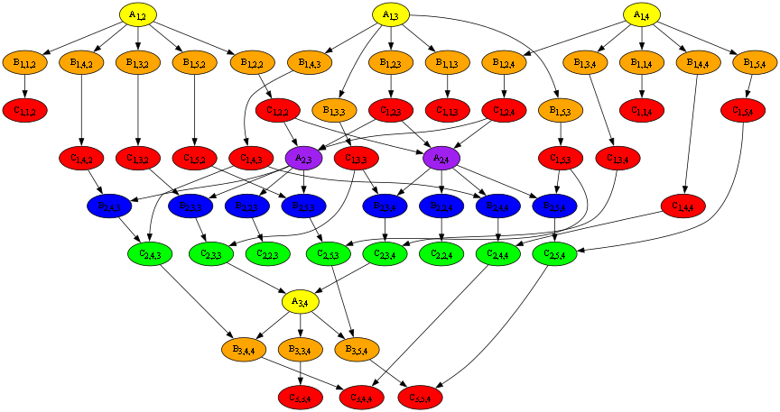
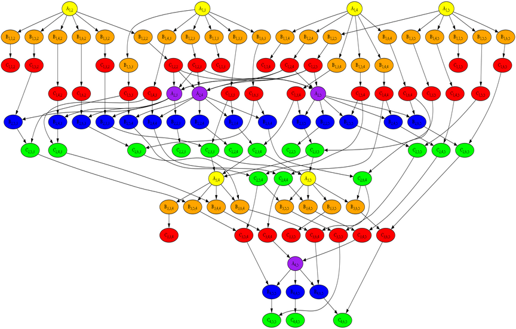

---
jupyter:
  kernelspec:
    display_name: Python 3 (ipykernel)
    language: python
    name: python3
  language_info:
    codemirror_mode:
      name: ipython
      version: 3
    file_extension: .py
    mimetype: text/x-python
    name: python
    nbconvert_exporter: python
    pygments_lexer: ipython3
    version: 3.12.2
  nbformat: 4
  nbformat_minor: 5
---

::: {#d4ec599bae2bad28 .cell .markdown collapsed="false"}
# Sprawozdanie - Laboratorium 7

## Autor: Tomasz Paja

### Cel zadania:

Zadanie polega na wykonaniu następujących etapów (dla macierzy o
rozmiarze $N$):

1.  Proszę zlokalizować niepodzielne czynności wykonywane przez
    algorytm, nazwać je oraz zbudować alfabet w sensie teorii śladów.\
2.  Proszę skonstruować relację zależności dla alfabetu, opisującego
    algorytm eliminacji Gaussa.\
3.  Proszę przedstawić algorytm eliminacji Gaussa w postaci ciągu
    symboli alfabetu.\
4.  Proszę wygenerować graf zależności Diekerta.\
5.  Proszę przekształcić ciąg symboli opisujący algorytm do postaci
    normalnej Foaty.

Proszę zaprojektować i zaimplementować współbieżny algorytm eliminacji
Gaussa. W szczególności proszę zwrócić uwagę na implementację jak
najlepiej odwzorowującą graf zależności lub postać normalną Foaty.\
Program ma działać dla zadanych rozmiarów macierzy $N$.

### Wprowadzenie

Dany jest problem rozwiązania układu równań liniowych, który
reprezentowany jest przez wektor zmiennych $x$, wektor wyrazów wolnych
$y$ oraz macierz współczynników $M$. Wektory $x$ oraz $y$ mają długość
$N$, zaś macierz $M$ jst macierzą kwadratową o wymiarach $N$ x $N$.
Elementy wektorów $x$ oraz $y$ będziemy przedstawiać jako $x_i$ i $y_i$,
zaś macierzy $M$ jako $M_{i,j}$. Sprowadza się to do następującego
równania: $M \times x = y$, które można reprezentować jako:

$$
\begin{bmatrix}
    M_{1,1} & M_{1,2} & M_{1,3} & \cdots & M_{1,n} \\
    M_{2,1} & M_{2,2} & M_{3,2} & \cdots & M_{1,n} \\
    M_{3,1} & M_{3,2} & M_{3,3} & \cdots & M_{1,n} \\
    \vdots & \vdots & \vdots & \ddots & \vdots \\
    M_{n,1} & M_{n,2} & M_{n,3} & \cdots & M_{n,n}
\end{bmatrix}
\begin{bmatrix}
    x_1 \\
    x_2 \\
    x_3 \\
    \vdots \\
    x_n
\end{bmatrix}
=
\begin{bmatrix}
    y_1 \\
    y_2 \\
    y_3 \\
    \vdots \\
    y_n
\end{bmatrix}
$$\
Dla uproszczenia operacji, rozszerzmy macierz $M$ o wektor $y$:\
$$
\left[
\begin{array}{ccccc|c}
    M_{1,1} & M_{1,2} & M_{1,3} & \cdots & M_{1,n} & y_1 \\
    M_{2,1} & M_{2,2} & M_{3,2} & \cdots & M_{1,n} & y_2 \\
    M_{3,1} & M_{3,2} & M_{3,3} & \cdots & M_{1,n} & y_2 \\
    \vdots & \vdots & \vdots & \ddots & \vdots & \vdots \\
    M_{n,1} & M_{n,2} & M_{n,3} & \cdots & M_{n,n} & y_2 
\end{array}
\right]
$$ Teraz macierz ma $N+1$ kolumn - trzeba będzie to uwzględnić w
algorytmie.

### Lokalizacja niepodzielnych czynności algorytmu

Jak powszechnie wiadomo, algorytm Gaussa wykonuje kolejno pewne kroki
dla każdego wiersza macierzy, w celu uzyskania macierzy trójkątnej
górnej. Nieuwzględniając pivotingu kroki są następujące, poczynając od
pierwszego wiersza (i uwzględniając $N+1$ kolumn):

1.  Dla danego $i$-tego wiersza bierze jego $i$-ty element.\
2.  Dla każdego wiersza $k$ poniżej $i$-tego dzieli wartości elementu
    $M_{k, i}$ przez wartość elementu $M_{i,i}$ - uzyskuje w ten sposób
    mnożnik.
3.  Dla każdego $j \in \{i, i+1, \ldots, N+1\}$ mnoży element $M_{i,j}$
    macierzy przez uzyskany mnożnik i odejmuje uzyskany iloczyn od
    elementu $M_{k,j}$ - w ten sposób element $M_{k,i}$ jest zerowany.

Można zatem wyróżnić trzy główne czynności wykonywane przez algorytm:

1.  Szukanie mnożnika.\
2.  Pomnożenie danego elementu przez uzyskany mnożnik.\
3.  Odjęcie uzyskanego iloczynu od odpowiedniego elementu.

Oznaczymy te czynności jako:

1.  $A_{i,k}$ - znalezienie mnożnika dla wiersza $i$, do odejmowania go
    od $k$-tego wiersza.\
2.  $B_{i,j,k}$ - pomnożenie $j$-tego elementu wiersza $i$ przez
    mnożnik, do odejmowania od $k$-tego wiersza.\
3.  $C_{i,j,k}$ - odjęcie obliczonego iloczynu dla $j$-tej kolumny od
    wiersza $k$.

### Działanie algorytmu

Algorytm będzie wykonywał te zadania w odpowiedniej kolejności, którą
można zademonstrować poniższym pseudokodem:

    for i in range(N):
        for k in range(i+1, N):
            do A(i,k)
            for j in range(i, N+1):
                do B(i,j,k)
                do C(i,j,k)

Jak widać, algorytm będzie wykonywał operacje w następującej kolejności
(dla macierzy o wymiarach $3 \times 3$:

1.  Dla pierwszego wiersza:

Obliczanie drugiego wiersza: $$
A_{1,2}, B_{1,1,2}, C_{1,1,2}, B_{1,2,2}, C_{1,2,2}, B_{1,3,2}, C_{1,3,2}, B_{1,4,2}, C_{1,4,2}
$$ Obliczanie trzeciego wiersza: $$
A_{1,3}, B_{1,1,3}, C_{1,1,3}, B_{1,2,3}, C_{1,2,3}, B_{1,3,3}, C_{1,3,3}, B_{1,4,3}, C_{1,4,3}
$$

1.  Dla drugiego wiersza:

Obliczanie trzeciego wiersza: $$
A_{2,3}, B_{2,2,3}, C_{2,2,3}, B_{2,3,3}, C_{2,3,3}, B_{2,4,3}, C_{2,4,3}
$$

Cała sekwencja działania algorytmu wyglądać więc będzie następująco:\
$$
\begin{aligned}
A_{1,2}, B_{1,1,2}, C_{1,1,2}, B_{1,2,2}, C_{1,2,2}, B_{1,3,2}, C_{1,3,2}, B_{1,4,2}, C_{1,4,2}, \\
A_{1,3}, B_{1,1,3}, C_{1,1,3}, B_{1,2,3}, C_{1,2,3}, B_{1,3,3}, C_{1,3,3}, B_{1,4,3}, C_{1,4,3}, \\
A_{2,3}, B_{2,2,3}, C_{2,2,3}, B_{2,3,3}, C_{2,3,3}, B_{2,4,3}, C_{2,4,3}
\end{aligned}
$$

### Tworzenie alfabetu

Na podstawie powyższego przykładu możemy stworzyć alfabet dla naszego
problemu.

1.  Czynności $A$:\
    Wiemy, że czynności $A_{i,k}$ wykonywane są dla każdego
    $i \in \{1, 2, \ldots, N\}$ (wszystkich wierszy) i wszystkich $k$
    dla tego $i$, takich, że $k \in \{i+1, i+2, \ldots, N\}$. Zatem
    można utworzyć taki zbiór A:\
    $$
    A = \{ A_{i,k} \mid i \in \{1, 2, \ldots, N\} \land k \in \{i+1, i+2, \ldots, N\} \}
    $$ Należą do niego wszystkie czynności $A$, które algorytm wykona w
    trakcie działania.\
2.  Czynności $B$:\
    Dla każdego wiersza macierzy, a zatem dla każdego
    $i \in \{1, 2, \ldots, N\}$, i dla każdego wiersza niżej wiersza
    $i$, czyli wierszy $k \in \{i+1, i+2, \ldots, N\}$, wykonywana jest
    czynność mnożenia wartości w $j$-tej kolumnie wiersza $i$ i $k$,
    począwszy od kolumny o indeksie $i$. Można zatem zbiór takich
    czynności zapisać następująco:\
    $$
    B = \{ B_{i,j,k} \mid i \in \{1, 2, \ldots, N\} \land j \in \{i, i+1, \ldots, N+1\} \land k \in \{i+1, i+2, \ldots, N\} \}
    $$
3.  Czynności $C$:\
    Występuje tutaj pewna analogia do czynności $B$, ponieważ dla każdej
    czynności $B_{i,j,k} \in B$ występuje czynność $C_{i,j,k}$, która
    jest wykonywana od razu po czynności $B_{i,j,k}$. Zbiór $C$ będzie
    zatem wyglądał analogicznie do zbioru $B$:\
    $$
    C = \{ C_{i,j,k} \mid i \in \{1, 2, \ldots, N\} \land j \in \{i, i+1, \ldots, N+1\} \land k \in \{i+1, i+2, \ldots, N\} \}
    $$ Cały alfabet $\Sigma$ problemu będzie sumą zbiorów $A$, $B$ i
    $C$:\
    $$
    \Sigma = A \cup B \cup C
    $$

Funkcja, która generuje alfabet, może wyglądać następująco:
:::

::: {#4eadd97ff107f27c .cell .code execution_count="24" ExecuteTime="{\"end_time\":\"2025-01-14T14:28:57.499542900Z\",\"start_time\":\"2025-01-14T14:28:57.183026500Z\"}" collapsed="false"}
``` python
from copy import deepcopy

def create_alphabet_and_sequence(N: int) -> tuple[list[str], list[str]]:
    alphabet = []
    for i in range(1, N+1):
        for k in range(i+1, N+1):
            alphabet.append(f'A_{i},{k}')
            for j in range(i, N+2):
                alphabet.append(f'B_{i},{j},{k}')
                alphabet.append(f'C_{i},{j},{k}')
    sequence = deepcopy(alphabet)
    alphabet.sort()
    return alphabet, sequence
# end def
```
:::

::: {#8d3046ed92f80226 .cell .markdown collapsed="false"}
Dodaje ona po prostu wszystkie czynności, które będą wykonywane podczas
wykonywania algorytmu. Co ciekawe, sposób w jaki są dodawane, pozwala na
automatyczne skonstruowanie sekwencji działania algorytmu, która przyda
się później. Wywołajmy tę funkcję dla $N = 3$ i spójrzmy na alfabet:
:::

::: {#aaf446a47dd89c19 .cell .code execution_count="25" ExecuteTime="{\"end_time\":\"2025-01-14T14:28:57.548836Z\",\"start_time\":\"2025-01-14T14:28:57.192132500Z\"}" collapsed="false"}
``` python
N = 3
alphabet, sequence = create_alphabet_and_sequence(N)
print(alphabet)
```

::: {.output .stream .stdout}
    ['A_1,2', 'A_1,3', 'A_2,3', 'B_1,1,2', 'B_1,1,3', 'B_1,2,2', 'B_1,2,3', 'B_1,3,2', 'B_1,3,3', 'B_1,4,2', 'B_1,4,3', 'B_2,2,3', 'B_2,3,3', 'B_2,4,3', 'C_1,1,2', 'C_1,1,3', 'C_1,2,2', 'C_1,2,3', 'C_1,3,2', 'C_1,3,3', 'C_1,4,2', 'C_1,4,3', 'C_2,2,3', 'C_2,3,3', 'C_2,4,3']
:::
:::

::: {#7d2feb5c55b28028 .cell .markdown collapsed="false"}
Wygląda jak najbardziej poprawnie, identycznie jak alfabet utworzony
powyżej.

### Relacja zależności czynności

Czynności w algorytmie Gaussa są wykonywane w ustalonej kolejności. Nie
jest jednak wymagane, aby w jednym momencie wykonywała się tylko jedna
operacja, ponieważ niektóre z nich mogą być wykonywane jednocześnie.

Wnioskując z przedstawionego powyżej pseudokodu i znając zasady
działania algorytmu, można uznać, że jest ścisły związek między
czynnościami $B$ i $C$, co jest wyjaśnione wyżej, a więc te operacje
muszą być wykonywane sekwencyjne, jedna po drugiej (to znaczy dla
każdego $B_{i,j,k}$ po niej musi być wykonana czynność $C_{i,j,k}$).
Można jednak obliczać mnożniki symultanicznie (czyli działanie drugiej
pętli), a także wykonywać czynności wykonywane w trzeciej pętli
jednocześnie (czyli wykonywać na raz obliczenia dla zmiennej tej pętli).
Ponadto jest też ścisły związek między czynnościami $A$ i $B$, ponieważ
zanim obliczane są różnice, trzeba obliczyć mnożnik - czyli dla każdego
$B_{i,j,k}$ wcześniej musi się wykonać $A_{i,k}$.\
Co ciekawe, występuje również zależność między czynnościami ze zbioru
$A$ a czynnościami ze zbioru $C$, ale interesuje nas tylko wartość w
$i+1$-wszej kolumnie macierzy, zatem połączenie będzie tylko między
czynnościami $A_{i,k}$, w których wartość $i$ zgadza się z wartością $j$
czynności $C_{i,j,k}$.\
Występują jeszcze relacje z $C$ do $B$ i z $C$ do $C$. Pierwsza z nich
łączy po prostu operację $C_{i,j,k}$ z następną operacją
$B_{i+1,j,k+1}$. Druga natomiast łączy czynności $C$ między sobą - z
$C_{i,j,k}$ do $C_{i+1,j,k}$.

Czynności muszą być zatem wykonywane w kolejności $A$, $B$, $C$, ale
można uwzględnić powyższe wnioski.\
Relacja zależności będzie składała się z pięciu zbiorów - zbioru relacji
czynności $A$ i $B$, zbioru relacji czynności $B$ i $C$, zbioru relacji
$C$ i $A$ i dwóch ostatnich zbiorów - z $C$ do $B$ i z $C$ do $C$.
Rozbijmy ją zatem na pięć takich zbiorów:

1.  Zbiór relacji czynności $A$ i $B$:\
    $$
    D_1 = sym\left\{(A_{i,k}, B_{i,j,k}) \mid A_{i,k} \in \Sigma \land B_{i,j,k} \in \Sigma \right\}  
    $$ Dla przykładu macierzy $3 \times 3$ będzie ona wyglądała tak:\
    $$
    D_1 = sym\left\{
    \begin{aligned}
    (A_{1,2}, B_{1,1,2}), (A_{1,2}, B_{1,2,2}), (A_{1,2}, B_{1,3,2}), (A_{1,2}, B_{1,4,2}), \\
    (A_{1,3}, B_{1,1,3}), (A_{1,3}, B_{1,2,3}), (A_{1,3}, B_{1,3,3}), (A_{1,3}, B_{1,4,3}), \\
    (A_{2,3}, B_{2,2,3}), (A_{2,3}, B_{2,3,3}), (A_{2,3}, B_{2,4,3})
    \end{aligned}
    \right\}
    $$
2.  Zbiór relacji czynności $B$ i $C$:\
    $$
    D_2 = sym\left\{(B_{i,j,k}, C_{i,j,k}) \mid B_{i,j,k} \in \Sigma \land C_{i,j,k} \in \Sigma \right\}  
    $$ Dla przykładu rozważanego wcześniej będzie ona wyglądała tak:\
    $$
    D_2 = sym\left\{
    \begin{aligned}
    (B_{1,1,2}, C_{1,1,2}), (B_{1,2,2}, C_{1,2,2}), (B_{1,3,2}, C_{1,3,2}), (B_{1,4,2}, C_{1,4,2}), \\
    (B_{1,1,3}, C_{1,1,3}), (B_{1,2,3}, C_{1,2,3}), (B_{1,3,3}, C_{1,3,3}), (B_{1,4,3}, C_{1,4,3}), \\
    (B_{2,2,3}, C_{2,2,3}), (B_{2,3,3}, C_{2,3,3}), (B_{2,4,3}, C_{2,4,3})
    \end{aligned}
    \right\}
    $$
3.  Zbiór relacji czynności $C$ i $A$:\
    $$
    D_3 = sym\left\{(C_{i,j,k_1}, A_{j,k_2}) \mid j=i+1 \land C_{i,j,k_1} \in \Sigma \land A_{j,k_2} \in \Sigma \right\}
    $$ Dla prezentowanego przykładu będzie ona wyglądała następująco:\
    $$
    D_3 = sym\left\{
    \begin{aligned}
    (C_{1,2,2}, A_{2,3}), (C_{1,2,3}, A_{2,3})
    \end{aligned}
    \right\}
    $$
4.  Zbiór relacji czynności z $C$ do $B$:\
    $$
    D_4 = sym\left\{(C_{i,j,k}, B_{i+1,j,k+1}) \mid C_{i,j,k} \in \Sigma \land B_{i+1,j,k+1} \in \Sigma \right\}
    $$ Dla przykładu:\
    $$
    D_4 = sym\left\{
    \begin{aligned}
    (C_{1,2,2}, B_{2,2,3}), (C_{1,3,2}, B_{2,3,3}), (C_{1,4,2}, B_{2,4,3})
    \end{aligned}
    \right\}
    $$
5.  Zbiór relacji czynności z $C$ do $C$: $$
    D_5 = sym\left\{(C_{i_1,j,k}, C_{i_2,j,k}) \mid i_1 \lt i_2 \land C_{i_1,j,k} \in \Sigma \land C_{i_2,j,k} \in \Sigma \right\}
    $$ Dla przykładu będzie to wyglądało tak:\
    $$
    D_5 = sym\left\{
    \begin{aligned}
    (C_{1,2,3}, C_{2,2,3}), (C_{1,3,3}, C_{2,3,3}), (C_{1,4,3}, C_{2,4,3})
    \end{aligned}
    \right\}
    $$ Zbiór relacji $D$ będzie sumą wszystkich powyższych relacji oraz
    relacji identycznościowej $I_\Sigma$:\
    $$
    D = \left\{D_1 \cup D_2 \cup D_3 \cup D_4 \cup D_5 \right\}^+ \cup I_\Sigma
    $$

Przejrzysta funkcja dodająca po kolei wszystkie zbiory relacji może
wyglądać tak:
:::

::: {#cb823161037703fc .cell .code execution_count="26" ExecuteTime="{\"end_time\":\"2025-01-14T14:28:57.735331200Z\",\"start_time\":\"2025-01-14T14:28:57.211495200Z\"}" collapsed="false"}
``` python
def create_dependent_relations(N: int, alphabet: list[str]) -> list[tuple[str, str]]:
    dep_relations = []
    # D1 relations
    for i in range(1, N+1):
        for k in range(1, N+1):
            for j in range(1, N+2):
                if f'A_{i},{k}' in alphabet and f'B_{i},{j},{k}' in alphabet:
                    dep_relations.append((f'A_{i},{k}', f'B_{i},{j},{k}'))
    # D2 relations
    for i in range(1, N+1):
        for k in range(1, N+1):
            for j in range(1, N+2):
                if f'B_{i},{j},{k}' in alphabet and f'C_{i},{j},{k}' in alphabet:
                    dep_relations.append((f'B_{i},{j},{k}', f'C_{i},{j},{k}'))
    # D3 relations
    for i in range(1, N+1):
        for k in range(1, N+1):
            for j in range(1, N+2):
                for l in range(1, N+1):
                    if j == i+1 and f'C_{i},{j},{l}' in alphabet and f'A_{j},{k}' in alphabet:
                        dep_relations.append((f'C_{i},{j},{l}', f'A_{j},{k}'))
    # D4 relations
    for i in range(1, N+1):
        for k in range(1, N+1):
            for j in range(1, N+2):
                if f'C_{i},{j},{k}' in alphabet and f'B_{i+1},{j},{k+1}' in alphabet:
                    dep_relations.append((f'C_{i},{j},{k}', f'B_{i+1},{j},{k+1}'))
    # D5 relations
    for i in range(1, N+1):
        for k in range(1, N+1):
            for j in range(1, N+2):
                for l in range(i+1, N+1):
                    if f'C_{i},{j},{k}' in alphabet and f'C_{l},{j},{k}' in alphabet:
                        dep_relations.append((f'C_{i},{j},{k}', f'C_{l},{j},{k}'))
    return dep_relations
# end def
```
:::

::: {#71513d4b7265e2c8 .cell .markdown collapsed="false"}
Dla każdej relacji, dla bezpieczeństwa i zachowania poprawności, funkcja
sprawdza, czy dana czynność należy do zbioru. Zobaczmy, czy tutaj także
zbiór relacji będzie odpowiadał temu wyprowadzonemu:
:::

::: {#ad52e196d7aed074 .cell .code execution_count="27" ExecuteTime="{\"end_time\":\"2025-01-14T14:28:57.759335600Z\",\"start_time\":\"2025-01-14T14:28:57.217514700Z\"}" collapsed="false"}
``` python
dep_relations = create_dependent_relations(N, alphabet)
print(dep_relations)
```

::: {.output .stream .stdout}
    [('A_1,2', 'B_1,1,2'), ('A_1,2', 'B_1,2,2'), ('A_1,2', 'B_1,3,2'), ('A_1,2', 'B_1,4,2'), ('A_1,3', 'B_1,1,3'), ('A_1,3', 'B_1,2,3'), ('A_1,3', 'B_1,3,3'), ('A_1,3', 'B_1,4,3'), ('A_2,3', 'B_2,2,3'), ('A_2,3', 'B_2,3,3'), ('A_2,3', 'B_2,4,3'), ('B_1,1,2', 'C_1,1,2'), ('B_1,2,2', 'C_1,2,2'), ('B_1,3,2', 'C_1,3,2'), ('B_1,4,2', 'C_1,4,2'), ('B_1,1,3', 'C_1,1,3'), ('B_1,2,3', 'C_1,2,3'), ('B_1,3,3', 'C_1,3,3'), ('B_1,4,3', 'C_1,4,3'), ('B_2,2,3', 'C_2,2,3'), ('B_2,3,3', 'C_2,3,3'), ('B_2,4,3', 'C_2,4,3'), ('C_1,2,2', 'A_2,3'), ('C_1,2,3', 'A_2,3'), ('C_1,2,2', 'B_2,2,3'), ('C_1,3,2', 'B_2,3,3'), ('C_1,4,2', 'B_2,4,3'), ('C_1,2,3', 'C_2,2,3'), ('C_1,3,3', 'C_2,3,3'), ('C_1,4,3', 'C_2,4,3')]
:::
:::

::: {#e764818448a9d66c .cell .markdown collapsed="false"}
Wygląda poprawnie, a zatem możemy przejść dalej.

### Uogólniona zasada działania algorytmu

Na początku zobaczyliśmy, jak algorytm będzie działał dla macierzy o
wymiarach $3 \times 3$. Można jednak uogólnić zasadę jego działania i
wyprowadzić taką sekwencję dla macierzy $N$ x $N$. Zrobimy to,
korzystając z przykładu i pseudokodu.\
Wiemy, że po każdej czynności $A_{i,k}$ będzie występowało ileś par ze
zbiorów czynności $B$ i $C$. Z każdą kolejną wartością $i$ będzie ich o
jedną mniej. Można zatem zapisać, że po każdym $A_{i,k}$ występuje taki
ciąg par operacji $B_{i,j,k}$ i $C_{i,j,k}$:\
$$
B_{i,j,k}, C_{i,j,k}, B_{i,j+1,k}, C_{i,j+1,k}, B_{i,j+2,k}, C_{i,j+2,k}, \ldots, B_{i,N+1,k}, C_{i,N+1,k}, 
$$ Oznaczmy taki ciąg jako $BC_{i,k}$.\
Czynności $A_{j,k}$ jest, jak wiadomo, dokładnie $N$. Można zatem
zapisać, że cała sekwencja kroków algorytmu wygląda następująco:\
$$
A_{1,1}, BC_{1,1}, A_{1,2}, BC_{1,2}, \ldots, A_{1,N}, BC_{1,N}, A_{2,2}, BC_{2,2}, \ldots\ A_{N,N}, BC_{N,N}
$$

Tutaj właśnie przyda się zmienna `sequence` utworzona podczas tworzenia
alfabetu. Jeszcze raz zobaczmy jakie kroki będzie wykonywał algorytm dla
macierzy o wymiarach $3 \times 3$:
:::

::: {#643130e48177f00 .cell .code execution_count="28" ExecuteTime="{\"end_time\":\"2025-01-14T14:28:57.795342100Z\",\"start_time\":\"2025-01-14T14:28:57.229844300Z\"}" collapsed="false"}
``` python
print(*sequence, sep="; ")
```

::: {.output .stream .stdout}
    A_1,2; B_1,1,2; C_1,1,2; B_1,2,2; C_1,2,2; B_1,3,2; C_1,3,2; B_1,4,2; C_1,4,2; A_1,3; B_1,1,3; C_1,1,3; B_1,2,3; C_1,2,3; B_1,3,3; C_1,3,3; B_1,4,3; C_1,4,3; A_2,3; B_2,2,3; C_2,2,3; B_2,3,3; C_2,3,3; B_2,4,3; C_2,4,3
:::
:::

::: {#bfae11302cec2161 .cell .markdown collapsed="false"}
### Tworzenie grafu Diekert\'a

Problem uwspółbieżnienia algorytmu Gaussa można zaprezentować na grafie
Diekert\'a. Służy on do wnioskowania, które operacje można wykonywać
jednocześnie, a które wymagają poczekania, aż inne czynności się
wykonają.\
W tym celu użyjemy utworzonej wyżej sekwencji kroków i zbioru relacji
zależności. Skorzystamy również z funkcji utworzonych w poprzednim
sprawozdaniu, które utworzą wspomniany graf:
:::

::: {#6df15c5d5ac8bd2d .cell .code execution_count="29" ExecuteTime="{\"end_time\":\"2025-01-14T14:28:57.817332300Z\",\"start_time\":\"2025-01-14T14:28:57.246477900Z\"}" collapsed="false"}
``` python
import graphviz

def create_word_graph(dependent_relations: list[tuple[str, str]], word: list[str])\
        -> list[list[int]]:
    """
    Creates word graph with all edges.
    :param dependent_relations: Dependent relations between all chars.
    :param word: Word witch graph will be returned.
    :return: Graph of specified word with all edges, where numbers accord to index of character in word.
    """
    graph = [[] for _ in range(len(word))]
    for i in range(len(word)):
        curr_char = word[i]
        for j in range(i+1, len(word)):
            next_char = word[j]
            if (curr_char, next_char) in dependent_relations:
                graph[i].append(j)
    return graph
# end def


def create_final_graph(graph: list[list[int]]) -> list[list[int]]:
    """
    For specified word's graph creates its equivalent version without redundant edges.
    :param graph: Word's graph.
    :return: Graph without redundant edges.
    """
    edges = []
    for v in range(len(graph)):
        for u in graph[v]:
            edges.append((v, u))
    # print(edges)

    removed = 0
    edges_copy = deepcopy(edges)
    i = 0
    while i < len(edges_copy):
        right_vertex = edges_copy[i][1]
        j = 0
        while j < len(edges_copy):
            left_vertex = edges_copy[j][0]
            if right_vertex == left_vertex:
                new_edge = (edges_copy[i][0], edges_copy[j][1])
                edges_copy.append(new_edge)
                if edges_copy.count(new_edge) > 1:
                    if new_edge in edges:
                        edges.remove(new_edge)
                        removed += 1
            j += 1
        i += 1
    final_graph = [[] for _ in range(len(graph))]
    for edge in edges:
        final_graph[edge[0]].append(edge[1])
    return final_graph
# end def
```
:::

::: {#5714b5341f81a0e9 .cell .markdown collapsed="false"}
Po wywołaniu tych funkcji dla macierzy o wymiarach $3 \times 3$:
:::

::: {#766777c94a854a6a .cell .code execution_count="30" ExecuteTime="{\"end_time\":\"2025-01-14T14:28:57.818329400Z\",\"start_time\":\"2025-01-14T14:28:57.255621700Z\"}" collapsed="false"}
``` python
graph = create_word_graph(dep_relations, sequence)
final_graph = create_final_graph(graph)
print(final_graph)
```

::: {.output .stream .stdout}
    [[1, 3, 5, 7], [2], [], [4], [18], [6], [21], [8], [23], [10, 12, 14, 16], [11], [], [13], [18], [15], [22], [17], [24], [19, 21, 23], [20], [], [22], [], [24], []]
:::
:::

::: {#72252e37fe83a20d .cell .markdown collapsed="false"}
Zanim wyświetlimy graf, stwórzmy jeszcze postać normalną foaty, aby móc
kolorować każdy kolejny poziom czynności.

### Przekształcanie sekwencji czynności do postaci normalnej foaty (FNF)

Tutaj również skorzystamy z funkcji napisanej w poprzednim sprawozdaniu,
mianowicie `create_FNF`:
:::

::: {#a7e8e5fc286ed38 .cell .code execution_count="31" ExecuteTime="{\"end_time\":\"2025-01-14T14:28:57.840504600Z\",\"start_time\":\"2025-01-14T14:28:57.271280300Z\"}" collapsed="false"}
``` python
def create_FNF(final_graph: list[list[int]], word: list[str])\
        -> tuple[str, list[set]]:
    """
    Creates FNF of word.
    :param final_graph: Final version of word's graph.
    :param word: Specified word.
    :return: FNF of word.
    """

    foat_list = [set() for _ in range(len(word))]
    visited_vertices = [False for _ in range(len(word))]

    # Creating list of vertices that can be obtained in next step of operations.
    # Recursive function helps in identifying step in which variable will be called.
    def next_char(char_ind: int, depth: int):
        visited_vertices[char_ind] = True
        foat_list[depth].add(char_ind)
        for char in final_graph[char_ind]:
            next_char(char, depth + 1)
    # end def

    # Some vertices might not be available when starting in first vertex,
    # so we have to start recursive function in them also.
    while False in visited_vertices:
        next_char(visited_vertices.index(False), 0)

    # Now the normal foat form can be finally created.
    # The algorithm go from the back of foat_list, so from the deepest parts of graph,
    # and adds each sign to the front side of foat, if it was not used before,
    # because sometimes the same sign can occur in few levels of foat_list.
    # This is because there may be few ways to go to each sign, but we are interested only in the longest one.
    foat = ''
    already_used = []
    for i in range(len(word)-1, -1, -1):
        level = foat_list[i]
        is_it_first = True
        for number in level:
            if number not in already_used:
                already_used.append(number)
                if is_it_first:
                    foat = word[number] + ')' + foat
                    is_it_first = False
                else:
                    foat = word[number] + '; ' + foat
        if not is_it_first:
            foat = '(' + foat
    return foat, foat_list
# end def
```
:::

::: {#c3e4bf78f671043b .cell .markdown collapsed="false"}
Parametrem `word` w tym przypadku jest sekwencja czynności `sequence`, a
funkcja zwraca dodatkowo foatę w postaci listy, aby można było ją
wykorzystać podczas kolorowania grafu. W tym celu można stworzyć
funkcję, która zapisze, na którym poziomie są dane wierzchołki. Tą
funkcją będzie funkcja `provide_levels`:
:::

::: {#3889c2da09125c99 .cell .code execution_count="32" ExecuteTime="{\"end_time\":\"2025-01-14T14:28:57.841329800Z\",\"start_time\":\"2025-01-14T14:28:57.279369100Z\"}" collapsed="false"}
``` python
def provide_levels(foat_list: list[set]) -> list[int]:
    max_no_elements = 0
    for level in foat_list:
        max_no_elements += len(level)
    nodes_levels = [-1 for _ in range(max_no_elements)]
    for i, level in enumerate(foat_list):
        for el in level:
            nodes_levels[el] = i
    return nodes_levels
# end def
```
:::

::: {#b6210f46e094bd .cell .markdown collapsed="false"}
Funkcja kolorująca będzie teraz wyglądała tak (przy okazji będzie od
razu przeskalowywać obraz):
:::

::: {#982ebbbddb290f75 .cell .code execution_count="33" ExecuteTime="{\"end_time\":\"2025-01-14T14:28:57.858486600Z\",\"start_time\":\"2025-01-14T14:28:57.290809500Z\"}" collapsed="false"}
``` python
def draw_final_graph(final_graph: list[list[int]], word: list[str],
                     levels: list[int], filename: str):
    """
    Creates .png file presenting final word's graph in Examples/ directory.
    :param final_graph: Final version of word's graph.
    :param word: Specified word.
    :param filename: Name of the file, where .png file should be placed
    :return:
    """
    colors = ['yellow', 'orange', 'red', 'purple', 'blue', 'green']
    view = graphviz.Digraph(name=f'Examples/{filename}', format='png')
    view.attr(size='9,6')
    for v in range(len(final_graph)):
        for u in final_graph[v]:
            view.edge(str(v), str(u))
        label = word[v].replace('_', '<SUB>') + '</SUB>'
        view.node(str(v), label=f'<{label}>', style='filled',
                  fillcolor=colors[levels[v] % 6])
    view.render(view=True)
# end def
```
:::

::: {#d9c2a3bd1dbbd482 .cell .markdown collapsed="false"}
Wywołajmy zatem powyższe funkcje dla testowanego przypadku macierzy
$3 \times 3$:
:::

::: {#47a5714fecca8b25 .cell .code execution_count="34" ExecuteTime="{\"end_time\":\"2025-01-14T14:28:58.444293700Z\",\"start_time\":\"2025-01-14T14:28:57.299296Z\"}" collapsed="false"}
``` python
fnf, foat_list = create_FNF(final_graph, sequence)
draw_final_graph(final_graph, sequence, provide_levels(foat_list), f'{N}x{N}')
print(fnf)
```

::: {.output .stream .stdout}
    (A_1,3; A_1,2)(B_1,4,3; B_1,3,3; B_1,2,3; B_1,1,3; B_1,4,2; B_1,3,2; B_1,2,2; B_1,1,2)(C_1,4,3; C_1,3,3; C_1,2,3; C_1,1,3; C_1,4,2; C_1,3,2; C_1,2,2; C_1,1,2)(A_2,3)(B_2,4,3; B_2,3,3; B_2,2,3)(C_2,3,3; C_2,2,3; C_2,4,3)
:::
:::

::: {#b2f68d62212c173 .cell .markdown collapsed="false"}
Graf dla macierzy $3 \times 3$ wygląda tak:



Każdy kolejny kolor (od góry) oznacza czynności, które mogą być wykonane
jednocześnie. W przypadku większych macierzy kolory będą się zapętlały,
bo tablica kolorów ma tylko sześć wartości, więc nie wszystkie czynności
jednego koloru będą oznaczały jeden poziom. Różne poziomy tego samego
koloru będą jednak wyraźnie oddzielone (pomiędzy nimi jest pięć innych
kolorów). Na przykład dla macierzy $4 \times 4$ graf będzie wyglądał
tak:



Dla ułatwienia można złączyć wszystkie powyższe funkcje w jedną,
przyjmującą tylko rozmiar macierzy i zwracającą alfabet, sekwencję
czynności, relacje zależności i postać normalną foaty. Będzie ona
wyglądała tak:
:::

::: {#6ecd9d739b1c30b4 .cell .code execution_count="35" ExecuteTime="{\"end_time\":\"2025-01-14T14:28:58.450204100Z\",\"start_time\":\"2025-01-14T14:28:58.444668300Z\"}" collapsed="false"}
``` python
def graph_and_FNF(N: int):
    if N < 2:
        print("Too small matrix!")
        return None, None, None
    alphabet, sequence = create_alphabet_and_sequence(N)
    dep_relations = create_dependent_relations(N, alphabet)
    graph = create_word_graph(dep_relations, sequence)
    final_graph = create_final_graph(graph)
    fnf, foat_list = create_FNF(final_graph, sequence)
    levels = provide_levels(foat_list)
    draw_final_graph(final_graph, sequence, levels, f'{N}x{N}')
    return alphabet, sequence, dep_relations, fnf
# end def
```
:::

::: {#61269c76db97946c .cell .markdown collapsed="false"}
Wywołajmy zatem całą funkcję dla macierzy $4 \times 4$:
:::

::: {#52b483f648e08573 .cell .code execution_count="36" ExecuteTime="{\"end_time\":\"2025-01-14T14:29:00.692194Z\",\"start_time\":\"2025-01-14T14:28:58.452206200Z\"}" collapsed="false"}
``` python
alphabet, sequence, dep_relations, fnf = graph_and_FNF(4)
print(alphabet)
print(sequence)
print(dep_relations)
print(fnf)
```

::: {.output .stream .stdout}
    ['A_1,2', 'A_1,3', 'A_1,4', 'A_2,3', 'A_2,4', 'A_3,4', 'B_1,1,2', 'B_1,1,3', 'B_1,1,4', 'B_1,2,2', 'B_1,2,3', 'B_1,2,4', 'B_1,3,2', 'B_1,3,3', 'B_1,3,4', 'B_1,4,2', 'B_1,4,3', 'B_1,4,4', 'B_1,5,2', 'B_1,5,3', 'B_1,5,4', 'B_2,2,3', 'B_2,2,4', 'B_2,3,3', 'B_2,3,4', 'B_2,4,3', 'B_2,4,4', 'B_2,5,3', 'B_2,5,4', 'B_3,3,4', 'B_3,4,4', 'B_3,5,4', 'C_1,1,2', 'C_1,1,3', 'C_1,1,4', 'C_1,2,2', 'C_1,2,3', 'C_1,2,4', 'C_1,3,2', 'C_1,3,3', 'C_1,3,4', 'C_1,4,2', 'C_1,4,3', 'C_1,4,4', 'C_1,5,2', 'C_1,5,3', 'C_1,5,4', 'C_2,2,3', 'C_2,2,4', 'C_2,3,3', 'C_2,3,4', 'C_2,4,3', 'C_2,4,4', 'C_2,5,3', 'C_2,5,4', 'C_3,3,4', 'C_3,4,4', 'C_3,5,4']
    ['A_1,2', 'B_1,1,2', 'C_1,1,2', 'B_1,2,2', 'C_1,2,2', 'B_1,3,2', 'C_1,3,2', 'B_1,4,2', 'C_1,4,2', 'B_1,5,2', 'C_1,5,2', 'A_1,3', 'B_1,1,3', 'C_1,1,3', 'B_1,2,3', 'C_1,2,3', 'B_1,3,3', 'C_1,3,3', 'B_1,4,3', 'C_1,4,3', 'B_1,5,3', 'C_1,5,3', 'A_1,4', 'B_1,1,4', 'C_1,1,4', 'B_1,2,4', 'C_1,2,4', 'B_1,3,4', 'C_1,3,4', 'B_1,4,4', 'C_1,4,4', 'B_1,5,4', 'C_1,5,4', 'A_2,3', 'B_2,2,3', 'C_2,2,3', 'B_2,3,3', 'C_2,3,3', 'B_2,4,3', 'C_2,4,3', 'B_2,5,3', 'C_2,5,3', 'A_2,4', 'B_2,2,4', 'C_2,2,4', 'B_2,3,4', 'C_2,3,4', 'B_2,4,4', 'C_2,4,4', 'B_2,5,4', 'C_2,5,4', 'A_3,4', 'B_3,3,4', 'C_3,3,4', 'B_3,4,4', 'C_3,4,4', 'B_3,5,4', 'C_3,5,4']
    [('A_1,2', 'B_1,1,2'), ('A_1,2', 'B_1,2,2'), ('A_1,2', 'B_1,3,2'), ('A_1,2', 'B_1,4,2'), ('A_1,2', 'B_1,5,2'), ('A_1,3', 'B_1,1,3'), ('A_1,3', 'B_1,2,3'), ('A_1,3', 'B_1,3,3'), ('A_1,3', 'B_1,4,3'), ('A_1,3', 'B_1,5,3'), ('A_1,4', 'B_1,1,4'), ('A_1,4', 'B_1,2,4'), ('A_1,4', 'B_1,3,4'), ('A_1,4', 'B_1,4,4'), ('A_1,4', 'B_1,5,4'), ('A_2,3', 'B_2,2,3'), ('A_2,3', 'B_2,3,3'), ('A_2,3', 'B_2,4,3'), ('A_2,3', 'B_2,5,3'), ('A_2,4', 'B_2,2,4'), ('A_2,4', 'B_2,3,4'), ('A_2,4', 'B_2,4,4'), ('A_2,4', 'B_2,5,4'), ('A_3,4', 'B_3,3,4'), ('A_3,4', 'B_3,4,4'), ('A_3,4', 'B_3,5,4'), ('B_1,1,2', 'C_1,1,2'), ('B_1,2,2', 'C_1,2,2'), ('B_1,3,2', 'C_1,3,2'), ('B_1,4,2', 'C_1,4,2'), ('B_1,5,2', 'C_1,5,2'), ('B_1,1,3', 'C_1,1,3'), ('B_1,2,3', 'C_1,2,3'), ('B_1,3,3', 'C_1,3,3'), ('B_1,4,3', 'C_1,4,3'), ('B_1,5,3', 'C_1,5,3'), ('B_1,1,4', 'C_1,1,4'), ('B_1,2,4', 'C_1,2,4'), ('B_1,3,4', 'C_1,3,4'), ('B_1,4,4', 'C_1,4,4'), ('B_1,5,4', 'C_1,5,4'), ('B_2,2,3', 'C_2,2,3'), ('B_2,3,3', 'C_2,3,3'), ('B_2,4,3', 'C_2,4,3'), ('B_2,5,3', 'C_2,5,3'), ('B_2,2,4', 'C_2,2,4'), ('B_2,3,4', 'C_2,3,4'), ('B_2,4,4', 'C_2,4,4'), ('B_2,5,4', 'C_2,5,4'), ('B_3,3,4', 'C_3,3,4'), ('B_3,4,4', 'C_3,4,4'), ('B_3,5,4', 'C_3,5,4'), ('C_1,2,2', 'A_2,3'), ('C_1,2,3', 'A_2,3'), ('C_1,2,4', 'A_2,3'), ('C_1,2,2', 'A_2,4'), ('C_1,2,3', 'A_2,4'), ('C_1,2,4', 'A_2,4'), ('C_2,3,3', 'A_3,4'), ('C_2,3,4', 'A_3,4'), ('C_1,2,2', 'B_2,2,3'), ('C_1,3,2', 'B_2,3,3'), ('C_1,4,2', 'B_2,4,3'), ('C_1,5,2', 'B_2,5,3'), ('C_1,2,3', 'B_2,2,4'), ('C_1,3,3', 'B_2,3,4'), ('C_1,4,3', 'B_2,4,4'), ('C_1,5,3', 'B_2,5,4'), ('C_2,3,3', 'B_3,3,4'), ('C_2,4,3', 'B_3,4,4'), ('C_2,5,3', 'B_3,5,4'), ('C_1,2,3', 'C_2,2,3'), ('C_1,3,3', 'C_2,3,3'), ('C_1,4,3', 'C_2,4,3'), ('C_1,5,3', 'C_2,5,3'), ('C_1,2,4', 'C_2,2,4'), ('C_1,3,4', 'C_2,3,4'), ('C_1,3,4', 'C_3,3,4'), ('C_1,4,4', 'C_2,4,4'), ('C_1,4,4', 'C_3,4,4'), ('C_1,5,4', 'C_2,5,4'), ('C_1,5,4', 'C_3,5,4'), ('C_2,3,4', 'C_3,3,4'), ('C_2,4,4', 'C_3,4,4'), ('C_2,5,4', 'C_3,5,4')]
    (A_1,4; A_1,3; A_1,2)(B_1,5,4; B_1,4,4; B_1,3,4; B_1,2,4; B_1,1,4; B_1,5,3; B_1,4,3; B_1,3,3; B_1,2,3; B_1,1,3; B_1,5,2; B_1,4,2; B_1,3,2; B_1,2,2; B_1,1,2)(C_1,4,4; C_1,3,4; C_1,2,4; C_1,1,4; C_1,5,3; C_1,4,3; C_1,3,3; C_1,2,3; C_1,1,3; C_1,5,2; C_1,4,2; C_1,3,2; C_1,2,2; C_1,1,2; C_1,5,4)(A_2,4; A_2,3)(B_2,5,4; B_2,4,4; B_2,3,4; B_2,2,4; B_2,5,3; B_2,4,3; B_2,3,3; B_2,2,3)(C_2,5,4; C_2,4,4; C_2,3,4; C_2,2,4; C_2,5,3; C_2,4,3; C_2,3,3; C_2,2,3)(A_3,4)(B_3,5,4; B_3,4,4; B_3,3,4)(C_3,4,4; C_3,3,4; C_3,5,4)
:::
:::

::: {#9d897738e74654f1 .cell .markdown collapsed="false"}
Widać, że w tym wypadku jest już znacznie obszerniejszy alfabet,
sekwencja czynności jest dłuższa, ale szczególna różnica jest w liczbie
relacji zależności. Logicznym jest także, że foata składa się z większej
ilości poziomów, a co za tym idzie, graf jest głębszy (widok powyżej).\
Dla macierzy $5 \times 5$ i większych wyniki będą analogiczne, tylko
większe. Na przykład dla wspomnianej macierzy o $N = 5$ graf Diekert\'a
będzie wyglądał następująco:


:::

::: {#6aa906ee41a5400 .cell .markdown collapsed="false"}
### Odczytanie wejścia

Wejście reprezentowane jest jako plik `.txt`, w którego pierwszej linii
jest liczba $N$ reprezentująca wymiar macierzy, w kolejnych $N$ liniach
jest zapisana zawartość macierzy, a w ostatniej linii transponowany
wektor $y$. Trzeba jakoś odczytać to wejście i posłuży nam do tego
funkcja `get_and_form_data`:
:::

::: {#6ef3b6ce1e5d2374 .cell .code execution_count="37" ExecuteTime="{\"end_time\":\"2025-01-14T14:29:00.811730800Z\",\"start_time\":\"2025-01-14T14:29:00.702283Z\"}" collapsed="false"}
``` python
def get_and_form_data(filename: str)\
        -> tuple[
            int, list[list[float]],
            list[list[list[float]]],
            list[list[float]]
        ]:
    file = open(filename, 'r', encoding='utf-8')
    lines = file.readlines()
    file.close()

    N = int(lines[0])
    matrix = []
    for i in range(1, N+1):
        row = lines[i].strip().split(sep=' ')
        matrix.append(row)
    y = lines[N+1].strip().split(sep=' ')
    for i in range(N):
        matrix[i].append(y[i])
    for i in range(N):
        for j in range(N+1):
            matrix[i][j] = float(matrix[i][j])
    diff = [[[0 for k in range(N)] for j in range(N + 1)] for i in range(N)]
    mul = [[0 for k in range(N)] for i in range(N)]
    return N, matrix, diff, mul
# end def
```
:::

::: {#f4efd97d4bf9cdb6 .cell .markdown collapsed="false"}
Odczytajmy zatem przykładowy plik, aby uzyskać dane układu równań:
:::

::: {#88aab167f513b01a .cell .code execution_count="38" ExecuteTime="{\"end_time\":\"2025-01-14T14:29:00.851338200Z\",\"start_time\":\"2025-01-14T14:29:00.724699300Z\"}" collapsed="false"}
``` python
N, matrix, diff, mul = get_and_form_data('Examples/in.txt')
```
:::

::: {#4eb8272dced1fc3c .cell .markdown collapsed="false"}
### Definicja podstawowych operacji macierzowych

Operacje będą nazywały się analogicznie do czynności, a zatem:

-   Funkcja `A` będzie odpowiadała za obliczenie mnożnika - wpisze go do
    globalnej tablicy mnożników.
-   Funkcja `B` odpowiadać będzie za obliczenie różnicy do odjęcia -
    wpisze ją do globalnej tablicy różnic.
-   Funkcja `C` odejmie obliczoną różnicę od odpowiedniego elementu
    macierzy.

Wyglądają one tak:
:::

::: {#56bdd5e7df7c7bf .cell .code execution_count="39" ExecuteTime="{\"end_time\":\"2025-01-14T14:29:00.854361200Z\",\"start_time\":\"2025-01-14T14:29:00.738139100Z\"}" collapsed="false"}
``` python
def A(matrix: list[list[float]], i: int, k: int):
    mul[k][i] = matrix[k][i] / matrix[i][i]
# end def


def B(matrix: list[list[float]], i: int, j: int, k: int,
      multiplier: float):
    diff[i][j][k] = matrix[i][j] * multiplier
# end def


def C(matrix: list[list[float]], i: int, j: int, k: int,
      value: float):
    matrix[k][j] -= value
# end def
```
:::

::: {#71189b3dccb16592 .cell .markdown collapsed="false"}
### Implementacja schedulera dla nowych klas Foaty

Foata z laboratorium nr 5 zwraca listę zbiorów. Każdy zbiór odpowiada
wierzchołkom na danym poziomie, jednak niektóre wierzchołki występują w
kilku zbiorach. Trzeba usunąć duplikaty i zostawić te, które są
najgłębiej. Posłuży do tego funkcja `reduce_foat_list`:
:::

::: {#3e0e63d0c638fa67 .cell .code execution_count="40" ExecuteTime="{\"end_time\":\"2025-01-14T14:29:00.855911500Z\",\"start_time\":\"2025-01-14T14:29:00.751704Z\"}" collapsed="false"}
``` python
def reduce_foat_list(foat_list: list[set[int]]):
    already_used = []
    new_foat = deepcopy(foat_list)
    for i in range(len(new_foat) - 1, -1, -1):
        level = new_foat[i]
        for el in level:
            if el in already_used:
                foat_list[i].remove(el)
            else:
                already_used.append(el)
```
:::

::: {#f696966cc2f0cb51 .cell .markdown collapsed="false"}
Wpisuje ona znalezione już elementy do tablicy `already_used`, a jeżeli
dany element wystąpi ponownie, to usuwa go z foaty z tego drugiego
miejsca.\
Scheduler dla tak powstałych klas foaty może wyglądać następująco:
:::

::: {#48aac3797d77be44 .cell .code execution_count="41" ExecuteTime="{\"end_time\":\"2025-01-14T14:29:00.890924400Z\",\"start_time\":\"2025-01-14T14:29:00.760550400Z\"}" collapsed="false"}
``` python
from threading import Thread

def multithread(matrix: list[list[float]], foat_list: list[set[int]],
                seq: list[str], N: int) -> list[list[float]]:
    for level in foat_list:
        threads = []
        for el in level:
            action = seq[el]
            match action[0]:
                case 'A':
                    i = int(action[2]) - 1
                    k = int(action[4]) - 1
                    thread = Thread(
                        target=A,
                        args=(matrix, i, k)
                    )
                    thread.start()
                case 'B':
                    i = int(action[2]) - 1
                    j = int(action[4]) - 1
                    k = int(action[6]) - 1
                    thread = Thread(
                        target=B, 
                        args=(matrix, i, j, k, mul[k][i])
                    )
                    thread.start()
                case 'C':
                    i = int(action[2]) - 1
                    j = int(action[4]) - 1
                    k = int(action[6]) - 1
                    thread = Thread(
                        target=C,
                        args=(matrix, i, j, k, diff[i][j][k])
                    )
                    thread.start()
            threads.append(thread)
        for thread in threads:
            thread.join()
    return matrix
# end def
```
:::

::: {#c4c22c2789a295a0 .cell .markdown collapsed="false"}
Dla każdego poziomu foaty tworzy tyle wątków, ile jest elementów na tym
poziomie. Następnie wywołuje te wątki, a na końcu, co najważniejsze,
wywołuje `.join()` na wszystkich wątkach po kolei. Program może zatem
wykonywać kilka wątków naraz i nie czekać aż któryś się skończy. Macierz
po wywołaniu tej funkcji przyjmuje postać trójkątną górą i dla pliku
*in.txt* zawierającego takie dane:\
3\
2.0 1.0 3.0\
4.0 3.0 8.0\
6.0 5.0 16.0\
6.0 15.0 27.0,\
będzie wyglądała tak:
:::

::: {#fa716795ae638cb5 .cell .code execution_count="42" ExecuteTime="{\"end_time\":\"2025-01-14T14:29:00.891926300Z\",\"start_time\":\"2025-01-14T14:29:00.776328300Z\"}" collapsed="false"}
``` python
al, seq = create_alphabet_and_sequence(N)
final_graph = create_final_graph(
    create_word_graph(
        create_dependent_relations(
            N,
            al
        ),
        seq
    )
)
fnf, foat_list = create_FNF(final_graph, seq)
reduce_foat_list(foat_list)

matrix = multithread(matrix, foat_list, seq, N)


def print_matrix(matrix: list[list[float]]):
    for i in range(len(matrix)):
        print(matrix[i])
print_matrix(matrix)
```

::: {.output .stream .stdout}
    [2.0, 1.0, 3.0, 6.0]
    [0.0, 1.0, 2.0, 3.0]
    [0.0, 0.0, 3.0, 3.0]
:::
:::

::: {#a80e44845091f603 .cell .markdown collapsed="false"}
Widać, że macierz jest postaci trójkątnej górnej, z uwzględnieniem
wektora $y$ w ostatniej kolumnie.

### Rozwiązywanie macierzy trójkątnej górnej

Musimy teraz stworzyć funkcję, która obliczy wartości kolejnych $x$-ów i
zwróci wynik. Będzie to funkcja `solve_triangular_matrix`:
:::

::: {#330f8757733dd70f .cell .code execution_count="43" ExecuteTime="{\"end_time\":\"2025-01-14T14:29:00.961737600Z\",\"start_time\":\"2025-01-14T14:29:00.816551800Z\"}" collapsed="false"}
``` python
def solve_triangular_matrix(matrix: list[list[float]], N: int)\
        -> list[float]:
    x = [float("inf") for _ in range(N)]
    for i in range(N-1, -1, -1):
        for j in range(N-1, i, -1):
            matrix[i][N] -= matrix[i][j] * matrix[j][N]
            matrix[i][j] = 0
        matrix[i][N] /= matrix[i][i]
        matrix[i][i] = 1
        x[i] = matrix[i][N]
    print("Final matrix:")
    print_matrix(matrix)
    return x
# end def
```
:::

::: {#1242ac2b15fe1c3d .cell .markdown collapsed="false"}
Rozwiążmy ten układ zatem:
:::

::: {#39c9ad88aad17802 .cell .code execution_count="44" ExecuteTime="{\"end_time\":\"2025-01-14T14:29:00.964636200Z\",\"start_time\":\"2025-01-14T14:29:00.833143700Z\"}" collapsed="false"}
``` python
x = solve_triangular_matrix(matrix, N)
print("Results:\n", x)
```

::: {.output .stream .stdout}
    Final matrix:
    [1, 0, 0, 1.0]
    [0.0, 1, 0, 1.0]
    [0.0, 0.0, 1, 1.0]
    Results:
     [1.0, 1.0, 1.0]
:::
:::

::: {#45f0b154c831cfd7 .cell .markdown collapsed="false"}
Rozwiązania wyglądają obiecująco i po sprawdzeniu okazuje się, że
rzeczywiście są poprawne.

### Przykłady

Rozwiążmy teraz kilka przykładowych układów (niestety ze względu na
globalność tablic `diff` i `mul` trzeba te operacje wykonywać od nowa):

1.  Układ czterech równań:\
    4\
    3.0 1.0 -1.0 1.0\
    1.0 5.0 -3.0 0.0\
    1.0 3.0 0.0 -1.0\
    0.0 3.0 2.0 1.0\
    0.0 7.0 1.0 2.0
:::

::: {#942aa7e186dbd886 .cell .code execution_count="45" ExecuteTime="{\"end_time\":\"2025-01-14T14:29:02.409399300Z\",\"start_time\":\"2025-01-14T14:29:00.849104100Z\"}" collapsed="false"}
``` python
N, matrix, diff, mul = get_and_form_data('Examples/in_1.txt')
al, seq = create_alphabet_and_sequence(N)
final_graph = create_final_graph(
    create_word_graph(
        create_dependent_relations(
            N,
            al
        ),
        seq
    )
)
fnf, foat_list = create_FNF(final_graph, seq)
reduce_foat_list(foat_list)

matrix = multithread(matrix, foat_list, seq, N)
x = solve_triangular_matrix(matrix, N)
print("Results:\n", x)
```

::: {.output .stream .stdout}
    Final matrix:
    [1, 0, 0, 0, -1.0]
    [0.0, 1, 0, 0, 0.9999999999999998]
    [0.0, 0.0, 1, 0, -1.0000000000000002]
    [0.0, 0.0, 0.0, 1, 1.0]
    Results:
     [-1.0, 0.9999999999999998, -1.0000000000000002, 1.0]
:::
:::

::: {#635b819929243d1e .cell .markdown collapsed="false"}
1.  Układ czterech równań:\
    4\
    1.0 1.0 1.0 1.0\
    1.0 -1.0 1.0 1.0\
    1.0 -1.0 -1.0 1.0\
    2.0 1.0 1.0 -1.0\
    2.0 -2.0 -2.0 5.0
:::

::: {#9c3e5de6a60f7bde .cell .code execution_count="46" ExecuteTime="{\"end_time\":\"2025-01-14T14:29:04.130325100Z\",\"start_time\":\"2025-01-14T14:29:02.403724500Z\"}" collapsed="false"}
``` python
N, matrix, diff, mul = get_and_form_data('Examples/in_2.txt')
al, seq = create_alphabet_and_sequence(N)
final_graph = create_final_graph(
    create_word_graph(
        create_dependent_relations(
            N,
            al
        ),
        seq
    )
)
fnf, foat_list = create_FNF(final_graph, seq)
reduce_foat_list(foat_list)

matrix = multithread(matrix, foat_list, seq, N)
x = solve_triangular_matrix(matrix, N)
print("Results:\n", x)
```

::: {.output .stream .stdout}
    Final matrix:
    [1, 0, 0, 0, 1.0]
    [0.0, 1, 0, 0, 2.0]
    [0.0, 0.0, 1, 0, -0.0]
    [0.0, 0.0, 0.0, 1, -1.0]
    Results:
     [1.0, 2.0, -0.0, -1.0]
:::
:::

::: {#27e0ed75f342c6d .cell .markdown collapsed="false"}
Można zauważyć, że układy rozwiązywane są poprawnie, zatem algorytm
działa.
:::
