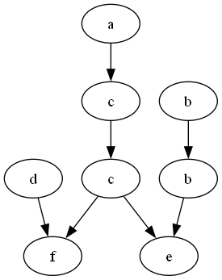
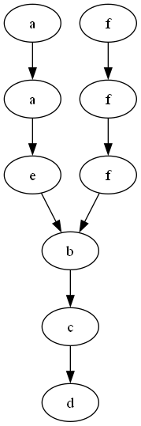

# Sprawozdanie - Laboratorium nr 5
## Autor: Tomasz Paja

### Cel laboratorium:  
Napisz program, który dla zadanego alfabetu zmiennych $A$, w którym każda litera oznacza akcję, układu równań akcji na zmiennych oraz słowa $w$, oznaczającego przykładową sekwencję akcji, wyznacza:
1. Relację zależności zmiennych $D$.  
2. Relację niezależności zmiennych $I$.
3. Postać normalną Foaty $FNF([w])$ śladu $[w]$.
4. Graf zależności słowa $w$ w postaci minimalnej.  

### Rozwiązanie  
Biblioteki użyte podczas rozwiązywania zadania:  


```python
import copy
import graphviz
```


W kolejnych krokach przedstawię rozwiązanie zadania.  

#### Wczytywanie danych  

Na początku wczytujemy dane z pliku `filename`, umieszczonego w folderze *Examples*, za pomocą funkcji `get_and_form_data`:  


```python
def get_and_form_data(filename: str) -> (list[str], str, str):
    """
    Reads data from specified file.
    :param filename: name of file.
    :return: List of formatted equations, alphabet as string, specified word.
    """
    file = open(f'Examples/{filename}', 'r', encoding='utf-8')
    lines = file.readlines()
    file.close()

    # Equations
    list_of_equations = []
    for line in lines[:-2]:
        if line[0] == '(':
            list_of_equations.append([line[1]])
            for char in line[3:]:
                if char.isalpha():
                    list_of_equations[lines.index(line)].append(char)

    for equation in list_of_equations:
        concat_variables = ''
        for var in equation[2:]:
            concat_variables += var
        equation[2:] = [concat_variables]

    # Alphabet
    i = 0
    while lines[-2][i] != '{':
        i += 1
    alphabet = lines[-2][i+1:-2].split(sep=",")
    for char in alphabet:
        if len(char) > 1:
            alphabet[alphabet.index(char)] = char[1]

    # Removing equations for characters not mentioned in the alphabet
    for equation in list_of_equations:
        if equation[0] not in alphabet:
            list_of_equations.remove(equation)

    # Get word
    i = 0
    while lines[-1][i] != '=':
        i += 1
    word = lines[-1][i+2:]

    return list_of_equations, alphabet, word
# end def
```

Funkcja ta przyjmuje jako parametr tylko nazwę pliku `filename` postaci:  
```
(a) x := x + 1
(b) y := y + 2z
(c) x := 3x + z
(d) w := w + v
(e) z := y - z
(f) v := x + v
A = {a, b, c, d, e, f}
w = acdcfbbe
```
gdzie linijki poprzedzone literkami w okrągłych nawiasach to akcje wykonywane przez zmienne, litera $A$ oznacza alfabet zmiennych, zaś $w$ jest słowem.  
Po odczytaniu pliku funkcja zwraca:  
* sformatowaną listę równań  
* alfabet w postaci listy zmiennych  
* słowo jako napis  

Przykładowy wynik funkcji dla powyższego pliku:  


```python
equations, alphabet, word = get_and_form_data('case1.txt')
print(equations)
print(alphabet)
print(word)
```

    [['a', 'x', 'x'], ['b', 'y', 'yz'], ['c', 'x', 'xz'], ['d', 'w', 'wv'], ['e', 'z', 'yz'], ['f', 'v', 'xv']]
    ['a', 'b', 'c', 'd', 'e', 'f']
    acdcfbbe
    

W liście `equations` mamy listę dla każdego równania, w której:  
* pierwszy znak oznacza zmienną, która wywołuje dane równanie,  
* drugi znak oznacza liczbę, która jest modyfikowana w danym równaniu,  
* ciąg znaków na końcu listy jest konkatenacją liczb, które ulegają zmianie w danym równaniu.  

Następnie mamy alfabet w postaci listy znaków oraz słowo w postaci napisu.  
Po utworzeniu alfabetu w funkcji sprawdzamy dodatkowo, czy w układzie równań nie ma przypadkiem równania dla zmiennej nienależącej do alfabetu. Jeśli tak jest, to usuwamy takie równanie.  

#### Tworzenie relacji zależności $D$ i relacji niezależności $I$  
Kolejnym krokiem jest utworzenie relacji zależności i niezależności zmiennych w alfabecie. Jest za to odpowiedzialna funkcja `create_relations`:  


```python
def create_relations(list_of_equations: list[str]) -> (list[tuple[str, str]], list[tuple[str, str]]):
    """
    Creates relations for specified list of equations.
    :param list_of_equations: List of equations as list.
    :return: List of dependent relations and list of independent relations.
    """
    dependent_relations = []
    independent_relations = []
    for equation in list_of_equations:
        dependent_relations.append((equation[0], equation[0]))
        char_changed = equation[1]
        for check_equation in list_of_equations[list_of_equations.index(equation)+1:]:
            if char_changed in check_equation[2] or check_equation[1] in equation[2]:
                dependent_relations.append((equation[0], check_equation[0]))
            else:
                independent_relations.append((equation[0], check_equation[0]))

    for relation in dependent_relations:
        if relation[0] < relation[1]:
            dependent_relations.append((relation[1], relation[0]))
    for relation in independent_relations:
        if relation[0] < relation[1]:
            independent_relations.append((relation[1], relation[0]))

    return sorted(dependent_relations), sorted(independent_relations)
# end def
```

Funkcja przyjmuje jako parametr tylko i wyłącznie listę równań `list_of_equations` - tę, którą uzyskaliśmy wywołując funkcję `get_and_form_data`.  
Dla każdego równania funkcja dodaje do relacji zależności $D$ relację identycznościową, np. $(a,a)$, a następnie sprawdza, czy liczba, która jest zmieniana w danym równaniu, występuje w innych równaniach po prawej stronie i na odwrót - czy liczby występujące w tym równaniu po prawej stronie, występują w innych po lewej. Jeżeli tak, to dodaje tę relację do zbioru $D$, a jeżeli nie, to oznacza to, że dwa równania są od siebie niezależne, więc relacja ląduje w zbiorze niezależności $I$. Każda z dodawanych relacji reprezentowana jest w postaci krotki, a działanie pętli powoduje, że w zapisanych relacjach zmienna po prawej stronie jest większa lub równa leksykograficznie od zmiennej po lewej. W następnych pętlach funkcja tworzy relacje symetryczne (warunek w pętlach gwarantuje, że nie będzie duplikatów). Na końcu funkcja zwraca posortowane zbiory.  
Dla przedstawionego wyżej przykładu zbiory te prezentują się następująco:  


```python
dep_relations, indep_relations = create_relations(equations)
print(dep_relations)
print(indep_relations)
```

    [('a', 'a'), ('a', 'c'), ('a', 'f'), ('b', 'b'), ('b', 'e'), ('c', 'a'), ('c', 'c'), ('c', 'e'), ('c', 'f'), ('d', 'd'), ('d', 'f'), ('e', 'b'), ('e', 'c'), ('e', 'e'), ('f', 'a'), ('f', 'c'), ('f', 'd'), ('f', 'f')]
    [('a', 'b'), ('a', 'd'), ('a', 'e'), ('b', 'a'), ('b', 'c'), ('b', 'd'), ('b', 'f'), ('c', 'b'), ('c', 'd'), ('d', 'a'), ('d', 'b'), ('d', 'c'), ('d', 'e'), ('e', 'a'), ('e', 'd'), ('e', 'f'), ('f', 'b'), ('f', 'e')]
    

#### Graf zależności  
Teraz możemy już utworzyć graf zależności między zmiennymi w słowie $w$. Służy temu funkcja `create_word_graph`:  


```python
def create_word_graph(dependent_relations: list[tuple[str, str]], word: str) -> list[list[int]]:
    """
    Creates word graph with all edges.
    :param dependent_relations: Dependent relations between all chars.
    :param word: Word witch graph will be returned.
    :return: Graph of specified word with all edges, where numbers accord to index of character in word.
    """
    graph = [[] for _ in range(len(word))]
    for i in range(len(word)):
        curr_char = word[i]
        for j in range(i+1, len(word)):
            next_char = word[j]
            if (curr_char, next_char) in dependent_relations:
                graph[i].append(j)
    return graph
# end def
```

Parametrami funkcji są `dependent_relations`, czyli zbiór relacji zależności między zmiennymi, oraz słowo $w$. Nie jest nam potrzebny zbiór $I$, ponieważ tworzymy graf zależności, a więc nie interesują nas niezależności między zmiennymi.  
Dla każdego znaku w słowie funkcja sprawdza, czy jest on w relacji zależności ze znakami występującymi po nim - jeżeli tak, to tworzy krawędź skierowaną od tego wierzchołka, do znalezionego. Graf reprezentowany jest w formie liczb, z których każda kolejna oznacza indeks danej litery w słowie $w$. Operowanie na literach mogłoby utrudnić tworzenie grafu, ponieważ litera może występować w słowie kilka razy.  
Kontynuując poprzedni przykład, otrzymujemy taki graf:  


```python
graph = create_word_graph(dep_relations, word)
graph
```


    [[1, 3, 4], [3, 4, 7], [4], [4, 7], [], [6, 7], [7], []]


Można zauważyć, że w grafie występują wyłącznie krawędzie skierowane w stronę kolejnych liter.  
Interesuje nas jednak graf, w którym nie ma redundantnych krawędzi, to znaczy takich, które da się złożyć z kilku innych. Musimy usunąć krawędzie, które wynikają z przechodniości relacji. Zajmie się tym funkcja `create_final_graph`:  


```python
def create_final_graph(graph: list[list[int]]) -> list[list[int]]:
    """
    For specified word's graph creates its equivalent version without redundant edges.
    :param graph: Word's graph.
    :return: Graph without redundant edges.
    """
    edges = []
    for v in range(len(graph)):
        for u in graph[v]:
            edges.append((v, u))
    # print(edges)

    removed = 0
    edges_copy = copy.deepcopy(edges)
    i = 0
    while i < len(edges_copy):
        right_vertex = edges_copy[i][1]
        j = 0
        while j < len(edges_copy):
            left_vertex = edges_copy[j][0]
            if right_vertex == left_vertex:
                new_edge = (edges_copy[i][0], edges_copy[j][1])
                edges_copy.append(new_edge)
                if edges_copy.count(new_edge) > 1:
                    if new_edge in edges:
                        edges.remove(new_edge)
                        removed += 1
            j += 1
        i += 1
    final_graph = [[] for _ in range(len(graph))]
    for edge in edges:
        final_graph[edge[0]].append(edge[1])
    return final_graph
# end def
```

Przyjmuje ona wcześniej utworzony graf jako swój parametr, po czym od razu tworzy listę krawędzi w nim występujących. Następnie tworzy kopię tej listy - to do niej będą dodawane nowo utworzone krawędzie, a zbędne krawędzie będą usuwane z listy `edges`. Rozpoczyna przechodzenie po każdej krawędzi z listy `edges_copy` i sprawdza dla niej, czy może z inną krawędzią złożyć jedną, większą krawędź. Tworzy się w ten sposób krawędź wynikająca z przechodniości relacji, która jest dodawana do tej listy. Od razu po tym funkcja sprawdza, czy nowa krawędź była już w liście. Jeśli tak, to oznacza to, że krawędź, która już tam była, może zostać usunięta, bo da się ją złożyć z innych. W takim wypadku jest ona usuwana, ale z listy `edges`. Tak właśnie funkcja sprawdza wszystkie możliwości, również dla nowopowstałych relacji, i na końcu tworzy finalny graf z okrojonej względem pierwotnej, listy `edges`.  
Dla przykładu wykonywanego wcześniej taki graf będzie wyglądał następująco:  


```python
final_graph = create_final_graph(graph)
final_graph
```


    [[1], [3], [4], [4, 7], [], [6], [7], []]


Widać, że został on bardzo okrojony, bo aż o pięć krawędzi, a zostało tylko siedem. Nadal jednak można uzyskać takie przejścia między zmiennymi jak w grafie wejściowym.  


#### Rysowanie grafu  

Chcielibyśmy jednak móc zobaczyć ten graf w formie wizualnej. Posłuży nam do tego biblioteka `graphviz`, którą wyżej zaimportowaliśmy. Użyjemy jej w funkcji `draw_final_graph`:  


```python
def draw_final_graph(final_graph: list[list[int]], word: str, filename: str):
    """
    Creates .png file presenting final word's graph in Examples/ directory.
    :param final_graph: Final version of word's graph.
    :param word: Specified word.
    :param filename: Name of the file, where .png file should be placed
    :return:
    """
    view = graphviz.Digraph(name=f'Examples/{filename}', format='png')
    for v in range(len(final_graph)):
        for u in final_graph[v]:
            view.edge(str(v), str(u))
        view.node(str(v), label=word[v])
    view.render(view=True)
# end def
```

Jej parametrami są: minimalny graf, słowo $w$ oraz nazwa pliku, w którym zapiszemy wizualizację grafu. Słowo jest nam potrzebne, abyśmy odpowiednio etykietowali wierzchołki w grafie, bo jak wiemy, nie używamy w nim liter, a kolejnych indeksów tychże liter w słowie.  
Funkcja tworzy graf i zapisuje go do pliku w postaci pliku `.png`, który jest umieszczany w folderze *Examples*. Wywołajmy ją na poprzednio utworzonym finalnym grafie:  


```python
draw_final_graph(final_graph, word, 'case1')
```

W folderze *Examples*, w którym zapisane są przypadki testowe, zapisała się wizualizacja grafu wyglądająca tak:  



Wygląda to bardzo dobrze, a ponadto spełnia warunki grafu minimalnego Diekert'a.  

#### Postać normalna foaty słowa $w$  

Ostatnim zadaniem jest wyznaczenie postaci normalnej foaty $FNF([w])$ zadanego słowa. Odpowiada za to funkcja `create_FNF` wyglądająca tak:   


```python
def create_FNF(final_graph: list[list[int]], word: str) -> str:
    """
    Creates FNF of word.
    :param final_graph: Final version of word's graph.
    :param word: Specified word.
    :return: FNF of word.
    """

    foat_list = [set() for _ in range(len(word))]
    visited_vertices = [False for _ in range(len(word))]

    # Creating list of vertices that can be obtained in next step of operations.
    # Recursive function helps in identifying step in which variable will be called.
    def next_char(char_ind: int, depth: int):
        visited_vertices[char_ind] = True
        foat_list[depth].add(char_ind)
        for char in final_graph[char_ind]:
            next_char(char, depth + 1)
    # end def

    # Some vertices might not be available when starting in first vertex,
    # so we have to start recursive function in them also.
    while False in visited_vertices:
        next_char(visited_vertices.index(False), 0)

    # Some vertices are available by few ways and these ways can have different lengths.
    # Sometimes there is a problem when one way is shorter and can get vertex in fewer steps than another.
    # It may cause problem, when other vertices from longer ways should be called before vertex of this way.
    # We have to prevent such situations and code below does it.
    i = 0
    copied_foat_list = copy.deepcopy(foat_list)
    for step in copied_foat_list:
        for number in step:
            is_deeper = False
            next_set_number = i + 1
            while not is_deeper and next_set_number < len(word):
                if number in copied_foat_list[next_set_number]:
                    foat_list[i].remove(number)
                    is_deeper = True
                next_set_number += 1
        i += 1

    print("Foat list before final FNF creation", foat_list)

    # Creating final version of FNF with removal of redundant steps.
    # Redundant step can exist in foat_list because there are multiple ways to get to some vertices,
    # but we want to get only the shortest one.
    foat = ''
    for level in foat_list:
        is_it_first = True
        for number in level:
            if is_it_first:
                foat += '(' + word[number]
                is_it_first = False
            else:
                foat += word[number]
        if not is_it_first:
            foat += ')'
    return foat
# end def
```

Jako parametry przyjmuje minimalny graf słowa oraz to słowo. Jest ono nam potrzebne w ten sam sposób, co w funkcji `draw_final_graph`, bo znowu operujemy na grafie z wierzchołkami liczbowymi.  
W pierwszej kolejności tworzy ona listę, w której pod kolejnymi indeksami umieszczone są numery znaków, do których możemy dojść w liczbie kroków równej indeksowi. Czasem ze startowego wierzchołka nie da dojść się do wszystkich pozostałych, zatem trzeba wywołać zagnieżdżoną rekurencyjną funkcję `next_char` dla każdego wierzchołka, zachowującego się jak startowy. Dlatego potrzebujemy tablicy `visited_vertices`, która będzie odznaczać odwiedzone wierzchołki i dopóki nie będzie cała wypełniona wartościami *True*, dopóty będziemy wywoływać zagnieżdżoną funkcję na wierzchołkach oznaczonych jako *False*. Ponadto, do niektórych z nich można dojść kilkoma drogami. Czasem ta krótsza droga nie jest poprawna, ponieważ wywołanie akcji z danego wierzchołka może wymagać wywołania akcji innych wierzchołków z innej, dłuższej drogi. Trzeba temu zapobiec i służy do tego kolejny zestaw pętli, który sprawdza, czy dana zmienna nie występuje głębiej w foacie i jeśli tak, to usuwa ją z tego płytszego miejsca.  
Ponownie, sprawdźmy działanie funkcji dla omawianego przykładu:  


```python
foat = create_FNF(final_graph, word)
print(foat)
```

    Foat list before final FNF creation [{0, 2, 5}, {1, 6}, {3}, {4, 7}, set(), set(), set(), set()]
    (adb)(cb)(c)(fe)
    

Wygląda poprawnie. Sklejmy wszystkie funkcje w jedną, w pełni działającą.  

#### Funkcja całościowa  
Program złożony w całość tworzy funkcja `solve`:  


```python
def solve(filename: str) -> (list[tuple[str, str]], list[tuple[str, str]], list[list[int]], str):
    equations, alphabet, word = get_and_form_data(filename)
    dep_relations, indep_relations = create_relations(equations)
    graph = create_word_graph(dep_relations, word)
    final_graph = create_final_graph(graph)
    draw_final_graph(final_graph, word, filename[:-4])
    fnf = create_FNF(final_graph, word)
    return dep_relations, indep_relations, final_graph, fnf
# end def
```

Wypiszmy wyniki dla innego przykładu:  


```python
d, i, fg, fnf = solve('case2.txt')
print("Dependent relations: ", d)
print("Independent relations: ", i)
print("Final graph: ", fg)
print("FNF: ", fnf)
```

    Foat list before final FNF creation [{0, 1}, {2, 4}, {3, 5}, {6}, {7}, {8}, set(), set(), set()]
    Dependent relations:  [('a', 'a'), ('a', 'b'), ('a', 'c'), ('a', 'd'), ('a', 'e'), ('b', 'a'), ('b', 'b'), ('b', 'c'), ('b', 'd'), ('b', 'e'), ('b', 'f'), ('c', 'a'), ('c', 'b'), ('c', 'c'), ('c', 'd'), ('c', 'e'), ('c', 'f'), ('d', 'a'), ('d', 'b'), ('d', 'c'), ('d', 'd'), ('d', 'e'), ('d', 'f'), ('e', 'a'), ('e', 'b'), ('e', 'c'), ('e', 'd'), ('e', 'e'), ('f', 'b'), ('f', 'c'), ('f', 'd'), ('f', 'f')]
    Independent relations:  [('a', 'f'), ('e', 'f'), ('f', 'a'), ('f', 'e')]
    Final graph:  [[2], [4], [3], [6], [5], [6], [7], [8], []]
    FNF:  (af)(af)(ef)(b)(c)(d)
    

Graf wygląda tak:  



Dla tego przypadku wyniki również wyglądają na poprawne, zatem można uznać, że program dobrze działa.
